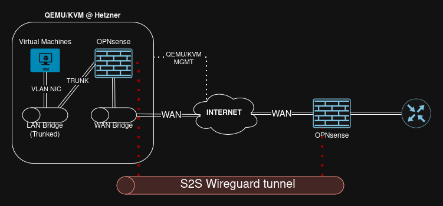

For a long time I have wanted a remote site at Hetzner, using a dedicated server as a virtualization host with QEMU/KVM.

This is my notes for how I implemented it into my existing infrastructure using a Wireguard site-to-site VPN.



## Ordering server

I went to [hetzner.com](https://www.hetzner.com/dedicated-rootserver/matrix-ax/) and ordered an `AX41-NVMe` with these settings:

- AMD Ryzen 5 3600
- 64 GB DDR4 + ECC
- 3 x 512 GB NVMe SSD
- 2 x Public IPv4

It took about 3 days for the server to be ready for login.

## Installing OS with QEMU/KVM

I used Hetzner's `installimage` script for installing `Debian 13` on a single of the 3 disks, so without any kind of software raid.

The reason for this is to keep the OS minimal, with all configs made by ansible and then use the 2 other disks as a mirrored zfs pool.

When the installation was done, it was time for my ansible roles to be executed on the host.

First I run a `debian_base` role, for adding software, users, networking, monitoring tools etc.

Then I executed my `debian_host` role, for making the server a `QEMU/KVM` host with zfs zpools/datasets and libvirt networking.

This left me with a `/etc/network/interfaces` and `/etc/sysctl.d/99-forwarding.conf` like this for doing a routed ipv4/ipv6 bridge network:

```
# The loopback network interface
auto lo
iface lo inet loopback
iface lo inet6 loopback

auto enp9s0
iface enp9s0 inet static
    address <redacted> # Primary IP for mgmt
    netmask 255.255.255.255
    gateway <redacted>
    dns-nameservers <redacted>
    pointopoint <redacted>

auto enp9s0
iface enp9s0 inet6 static
    address <redacted>
    netmask 64
    gateway fe80::1

auto br_wan
iface br_wan inet static
    address <redacted> # Primary IP for routing the secondary IP
    netmask 255.255.255.255
    bridge_ports none
    bridge_stp off
    bridge_fd 0
    pre-up brctl addbr br_wan
    up ip route add <redacted> dev br_wan
    down ip route del <redacted> dev br_wan

auto br_lan
iface br_lan inet manual
    bridge_ports none
```

```
net.ipv4.ip_forward=1
net.ipv6.conf.all.forwarding=1
```

## OPNsense

I created a VM and installed `OPNsense` with 2 NICs:

- br_wan
- br_lan

The br_wan NIC I assigned as the WAN interface in OPNsense, and the br_lan I created a VLAN and assigned that to the LAN interface.

### WAN

The WAN interface then got a static IPv4 assignment of my `secondary IP`, with a gateway pointing to the `primary IP`.
This is needed for Hetzner to actually route traffic, because of MAC-address filtering on their site, for obvious security reasons.

For more details, look at this great article [Additional IP Addresses](https://docs.hetzner.com/robot/dedicated-server/ip/additional-ip-adresses/)
and for details of [virtualization with the routed method](https://docs.hetzner.com/robot/dedicated-server/ip/additional-ip-adresses#use-with-virtualization-with-the-routed-method)

### LAN

This is straight forward, I just made a sub-interface with a vlan on the LAN NIC and assigned it with an IP in that vlan subnet.

### Wireguard

Now connecting my primary network to this new remote site, was too easy even though it was a first for me doing a `site-to-site` vpn using Wireguard.

I'm not gonna describe the details, instead look at this great guide from OPNsense: [WireGuard Site-to-site Setup](https://docs.opnsense.org/manual/how-tos/wireguard-s2s.html)

After creating some routes and firewall rules in my primary network and for the WireGuard interface, I could now reach the OPNsense on the mgmt vlan through the tunnel.

