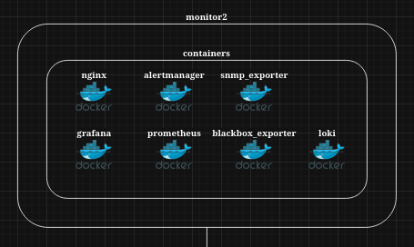

I have been running a homelab since 2016, with many changes through out the years.
At the moment my server is running on an older workstation with an ASUS B550-E gaming motherboard, with an AMD Ryzen 3900X CPU and 128GB DDR4 ECC Memory.

A couple of years back I changed my VM's to run the same structure:

- Applications run in docker containers
- Access to applications are being served through a reverse nginx proxy
- Except for database services (postgresql)

This setup has been very smooth for the past years, but I have one server which has reached its storage limit.

## Server: "monitor2"



This server is running the highest count of docker containers in my homelab, and it has now reached 100% storage usage.

The reason for this high storage usage is the overlay2 filesystem that my containers uses, is taking up all of the disk space.
Even though data for `Loki` and `Prometheus` are stored on a dedicated data disk, with volume mappings into the containers.

```bash
root@monitor2:~# df -h
Filesystem      Size  Used Avail Use% Mounted on
overlay          14G   14G     0 100% /var/lib/docker/overlay2/67003337bcf740fe239887c9b4b53a70abbdd1d24d495866c017910fed6a003d/merged
overlay          14G   14G     0 100% /var/lib/docker/overlay2/dee344557b2b9529e6e5880b193dfaddc848bbea49fe0e1d409b70fc71ccc032/merged
overlay          14G   14G     0 100% /var/lib/docker/overlay2/e07abce804d4373e4e93702c056e7841ddb043865302b003e3e72eade72d3c31/merged
overlay          14G   14G     0 100% /var/lib/docker/overlay2/56b4eddf2b7b0a6066dee7a1ff8995fe2410270c3c2a63d1393452e9770a028a/merged
overlay          14G   14G     0 100% /var/lib/docker/overlay2/19dd11497a70c0acfd6df9ef0f367ded3bcabfe24ca8497b08e44f635a1629d2/merged
overlay          14G   14G     0 100% /var/lib/docker/overlay2/82aee5d18295e15b802f39c18950bd838b8bae5f21edcd4b49f7b68d0be08e8d/merged
overlay          14G   14G     0 100% /var/lib/docker/overlay2/479a55122a27f2290a025d0f69959b19bd0990915ced638238fe1fd6a93bc411/merged
```

An easy solution would be to extend the disk and expand the ext4 filesystem.

```bash
Device     Boot    Start      End  Sectors  Size Id Type
/dev/vda1  *        2048 29456383 29454336   14G 83 Linux
/dev/vda2       29458430 31455231  1996802  975M  5 Extended
/dev/vda5       29458432 31455231  1996800  975M 82 Linux swap / Solaris
```

I prefer to `cure the disease and not the symptom`, so just expanding the disk for this VM isn't going to cut it, in the long run.

## Solution

I have decided to implement the following changes:

1. **Create new template VM with a 20G system disk.**
2. **Create a new `monitor3` server using the new template.**
2. **Migrate `Loki` from the monitor server to the log server.**

### 1. New template VM

The current template VM I'm using, isn't older than a year or so, but I was a bit too conservative when allocating the disk space.
I prefer treating my VM's as caddle and not pets, but being able to do a quick and easy disk expansion, could save me some critical issues in the long run, where time to resolve issues is limited.

This is how I created the new template: [Creating QEMU/KVM template]()

### 2. Create new monitor server

A year ago when I migrated to a new network infrastructure, I ended up placing my monitor server in a wrong VRF.
So one of the reasons for creating a new monitor server besides the storage issue, is to get it moved to where it actually belongs.

### 3. Migrate Loki service

One of the primary reasons for the misplacement of the `monitor2` server, was the Loki service. It required that my promtail agent(s) would be able to push logs to Loki.
Before running Loki, the only reason for clients connecting to the monitor server, would be for accessing Grafana dashboards.

But since my log collecting is happening in a logging server with `promtail` and `syslog-ng`, having Loki running next to it, makes sense.


