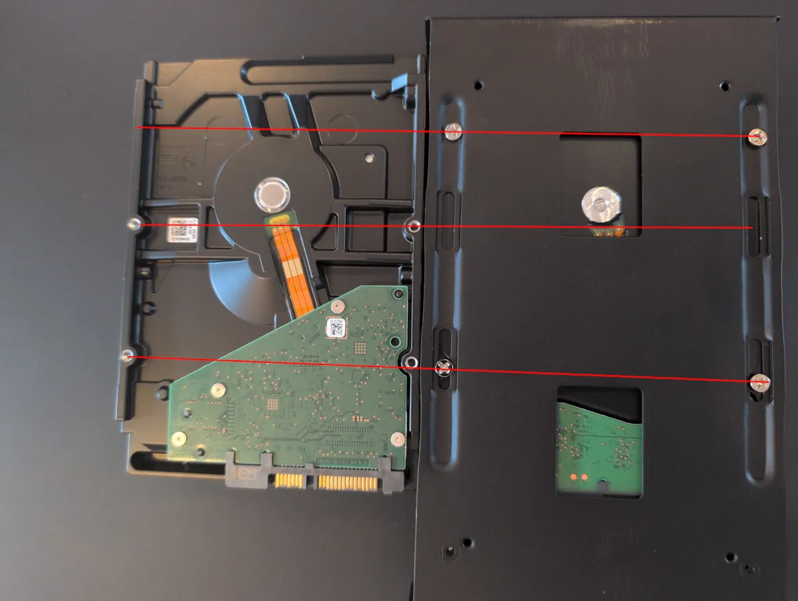

I was running low on storage in one of my servers and found some factory refurbished 18TB Ironwolf Pro for 230 euro each.
The upgrade of backup storage was also in the todo list, so by getting new disks I could repurpose the 8TB disks for backup, Win-Win!

I decided to do this upgrade **live** and not take the pool offline, as it's the first time I do a disk swap running ZFS, and I like the practice!

But ZFS is so simple, it doesn't feel like you practice anything.


## Upgrading

First thing first, I made sure the pool was healthy and no scans was running.

```bash
~$ zpool status
  pool: zpool1
 state: ONLINE
  scan: scrub repaired 0B in 03:27:23 with 0 errors on Sun Nov  9 03:51:31 2025
config:

	NAME                                 STATE     READ WRITE CKSUM
	zpool1                               ONLINE       0     0     0
	  mirror-0                           ONLINE       0     0     0
	    ata-ST8000DM004-2U9188_ZR15AR2N  ONLINE       0     0     0
	    ata-ST8000DM004-2U9188_ZR15BCEG  ONLINE       0     0     0

errors: No known data errors
```

I then unplugged my external drive from the server and confirmed the pool was still healthy allthough degraded.

```bash
~$ zpool status
  pool: zpool1
 state: DEGRADED
status: One or more devices has been removed by the administrator.
	Sufficient replicas exist for the pool to continue functioning in a
	degraded state.
action: Online the device using zpool online' or replace the device with
	'zpool replace'.
config:

	NAME                                  STATE     READ WRITE CKSUM
	zpool1                                DEGRADED     0     0     0
	  mirror-0                            DEGRADED     0     0     0
	    ata-ST8000DM004-2U9188_ZR15AR2N   REMOVED      0     0     0
	    ata-ST8000DM004-2U9188_ZR15BCEG   ONLINE       0     0     0

errors: No known data errors
```

### Embrace change

Fitting the new disk in the external enclousere was not as straight forward as I expected.

For some reason the screw holes for mounting on the bottom is different then any other disk I have worked with.
So I had to mark the placement of where the holes should be and drill them out in the mounting plate.



### Replace disk in pool

Finally after fitting the drive in the enclosure I plugged it back in to the server and used the `zfs replace` for making the pool aware of the new drive.

```bash
~# zpool replace zpool1 ata-ST8000DM004-2U9188_ZR15AR2N /dev/disk/by-id/ata-ST18000NE000-3G6101_ZVTKGJT0
~# zpool status
  pool: zpool1
 state: DEGRADED
status: One or more devices is currently being resilvered.  The pool will
	continue to function, possibly in a degraded state.
action: Wait for the resilver to complete.
  scan: resilver in progress since Sat Nov 21 18:30:15 2025
	569G / 4.72T scanned at 15.3G/s, 0B / 4.72T issued
	0B resilvered, 0.00% done, no estimated completion time
config:

	NAME                                    STATE     READ WRITE CKSUM
	zpool1                                  DEGRADED     0     0     0
	  mirror-0                              DEGRADED     0     0     0
	    replacing-1                         DEGRADED     0     0     0
          ata-ST8000DM004-2U9188_ZR15AR2N   ONLINE       0     0     0
	      ata-ST18000NE000-3G6101_ZVTKGJT0  ONLINE       0     0     0
        ata-ST8000DM004-2U9188_ZR15BCEG     REMOVED      0     0     0

errors: No known data errors
```

After some time the resilvering started by it self and took ~11 hours to complete.

```bash
~# zpool status
  pool: zpool1
 state: DEGRADED
status: One or more devices is currently being resilvered.  The pool will
	continue to function, possibly in a degraded state.
action: Wait for the resilver to complete.
  scan: resilver in progress since Sat Nov 21 18:30:41 2025
	1.71T / 4.72T scanned at 272M/s, 1.24T / 4.72T issued at 196M/s
	1.24T resilvered, 26.15% done, 05:10:58 to go
config:

	NAME                                    STATE     READ WRITE CKSUM
	zpool1                                  DEGRADED     0     0     0
	  mirror-0                              DEGRADED     0     0     0
	    ata-ST18000NE000-3G6101_ZVTKGJT0    ONLINE       0     0     0
	    replacing-1                         DEGRADED     0     0     0
	      ata-ST8000DM004-2U9188_ZR15BCEG   REMOVED      0     0     0
	      ata-ST18000NE000-3G6101_ZVTKGFF5  ONLINE       0     0     0  (resilvering)

errors: No known data errors
```

I got an email at 05:49 the next morning that my zfs pool has changed state from `DEGRADED` back to `ONLINE`.

```bash
~$ zpool status
  pool: zpool1
 state: ONLINE
status: Some supported and requested features are not enabled on the pool.
	The pool can still be used, but some features are unavailable.
action: Enable all features using 'zpool upgrade'. Once this is done,
	the pool may no longer be accessible by software that does not support
	the features. See zpool-features(7) for details.
  scan: resilvered 4.73T in 11:00:39 with 0 errors on Sat Nov 22 04:46:15 2025
config:

	NAME                                  STATE     READ WRITE CKSUM
	zpool1                                ONLINE       0     0     0
	  mirror-0                            ONLINE       0     0     0
	    ata-ST18000NE000-3G6101_ZVTKGJT0  ONLINE       0     0     0
	    ata-ST8000DM004-2U9188_ZR15BCEG   ONLINE       0     0     0

errors: No known data errors
```

I replicated the exact same procedure for the next disk in my mirror. Which for some reason finished the resilvering in only ~8 hours.

When the pool was back online, I had a value of `9.08T` for the property `EXPANDSZ` on my pool.

```bash
~# zpool list
NAME     SIZE  ALLOC   FREE  CKPOINT  EXPANDSZ   FRAG    CAP  DEDUP    HEALTH  ALTROOT
zpool1  7.27T  4.72T  2.54T        -     9.08T    18%    65%  1.00x    ONLINE  -
```

I went on to check if my pool had the autoexpand property set to `on` or `off` and changed it to `on`.

```bash
~# zpool get autoexpand zpool1
NAME    PROPERTY    VALUE   SOURCE
zpool1  autoexpand  off     default

~# zpool set autoexpand=on
```

> **autoexpand=on|off**\
> \
>   Controls automatic pool expansion when the underlying LUN is grown.  If set to on, the pool will be resized accord‐
>   ing to the size of the expanded device.  If the device is part of a mirror or raidz then all devices within that
>   mirror/raidz group must be expanded before the new space is made available to the pool.  The default behavior is
>   off.  This property can also be referred to by its shortened column name, expand.


```bash
```

I checked that the partitioning expanded with the new disk size before expanding the pool.

```bash
~# lsblk
NAME         MAJ:MIN RM   SIZE RO TYPE MOUNTPOINTS
sdb            8:16   0  16.4T  0 disk
├─sdb1         8:17   0  16.4T  0 part
└─sdb9         8:25   0     8M  0 part
sdc            8:32   0  16.4T  0 disk
├─sdc1         8:33   0  16.4T  0 part
└─sdc9         8:41   0     8M  0 part
```

Now the only thing left is to expand the devices in the pool to use all available space.

```bash
~# zpool online -e zpool1 ata-ST18000NE000-3G6101_ZVTKGJT0
~# zpool online -e zpool1 ata-ST18000NE000-3G6101_ZVTKGFF5
~# zpool list
NAME     SIZE  ALLOC   FREE  CKPOINT  EXPANDSZ   FRAG    CAP  DEDUP    HEALTH  ALTROOT
zpool1  16.4T  4.72T  11.6T        -         -     4%    28%  1.00x    ONLINE  -
```

> **zpool online**\
> \
> **-e**      Expand the device to use all available space.  If the device is part of a mirror or raidz then all devices
>         must be expanded before the new space will become available to the pool.

