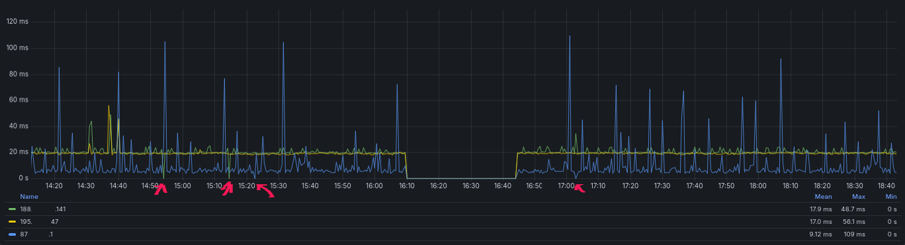
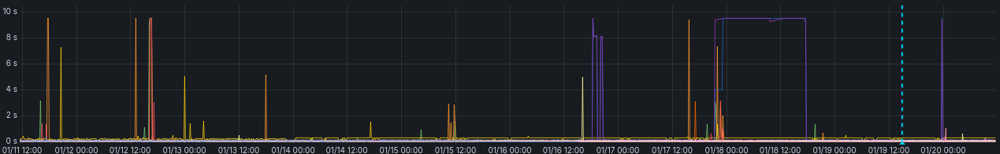
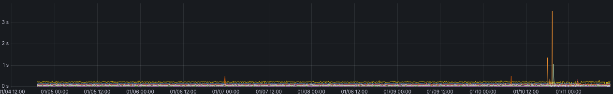

For the past week I have been troubleshooting a very inconsistent error on the WAN NIC for my new firewalls.
I got two `Protectli VP2440` with 2 x SFP+ and 2 x 2.5G Intel I226-V. I installed `OPNsense` on the boxes and got them deployed in a HA setup.

Immediately I tried downloading some large linux ISO's to see how the throughput would be, and after hitting ~100MB/s download speed, the WAN would cut out.

Looking through the logs, I did not see anything out of the normal, no errors, no warnings, no nothing.
I'm probing my ISP's gateway and two VPS's from different providers, for measuring my internet availability using blackbox_exporter. Looking at my Grafana dashboard,
I could see something was off. `1/3` of my probe targets would report ICMP was not going through. But not consistently, the probe targets would go down by turn with about 10m intervals.



I also started to notice some websites taking ~10s to load and then I got emails from alertmanager, telling me that my blackbox_exporter targets was hitting the timeout.



and for a refrence, this is how it normally looks, with an interruption the 10/01 where I deployed the firewalls.



## Troubleshooting

I started with gathering some data on what was actually happening and when.

- ICMP would stop working for 8.8.8.8 but not for 1.1.1.1
- HTTPS would timeout on some hosts but not others.

### ICMP

Running `traceroute 8.8.8.8` or `traceroute 1.1.1.1` would show the same path out of my ISP and then go to either google or cloudflare.

When I did `tcpdump` on my WAN NIC, I would see ICMP traffic leave for both of the targets, but only traffic from 1.1.1.1 would come back in.

I was always able to `ping 1.1.1.1` but every time I had issues it would cut traffic from 8.8.8.8.

So this was a **pattern** to follow.

Not long after I now experienced my ping traffic also cutting out for one of my rented VPS servers at hetzner. Now I was able to do a tcpdump on both sides.

#### tcpdump for local FW

```bash
13:20:17.503297 IP redacted.static.cust.fastspeed.dk > static.redacted.clients.your-server.de: ICMP echo request, id 15980, seq 5255, length 64
13:20:18.519553 IP redacted.static.cust.fastspeed.dk > static.redacted.clients.your-server.de: ICMP echo request, id 15980, seq 5256, length 64
13:20:19.527098 IP redacted.static.cust.fastspeed.dk > static.redacted.clients.your-server.de: ICMP echo request, id 15980, seq 5257, length 64
13:20:20.530589 IP redacted.static.cust.fastspeed.dk > static.redacted.clients.your-server.de: ICMP echo request, id 15980, seq 5258, length 64
```

#### tcpdump for VPS

```bash
13:20:17.515239 IP redacted.static.cust.fastspeed.dk > static.redacted.clients.your-server.de: ICMP echo request, id 15980, seq 5255, length 64
13:20:17.515290 IP static.redacted.clients.your-server.de > redacted.static.cust.fastspeed.dk: ICMP echo reply, id 15980, seq 5255, length 64
13:20:18.531662 IP redacted.static.cust.fastspeed.dk > static.redacted.clients.your-server.de: ICMP echo request, id 15980, seq 5256, length 64
13:20:18.531713 IP static.redacted.clients.your-server.de > redacted.static.cust.fastspeed.dk: ICMP echo reply, id 15980, seq 5256, length 64
13:20:19.539333 IP redacted.static.cust.fastspeed.dk > static.redacted.clients.your-server.de: ICMP echo request, id 15980, seq 5257, length 64
13:20:19.539426 IP static.redacted.clients.your-server.de > redacted.static.cust.fastspeed.dk: ICMP echo reply, id 15980, seq 5257, length 64
13:20:20.542705 IP redacted.static.cust.fastspeed.dk > static.redacted.clients.your-server.de: ICMP echo request, id 15980, seq 5258, length 64
13:20:20.542762 IP static.redacted.clients.your-server.de > redacted.static.cust.fastspeed.dk: ICMP echo reply, id 15980, seq 5258, length 64
```

**I could now verify that the issue was somewhere between my OPNsense firewall and the VPS server.**

### DNS

In the middle of everything, I discovered some error logs from my nginx in front of my internal DNS servers, showing issues with responding to queries all week.

I do not know how much of an impact this had on the HTTP probes hitting the 10s timeout, but it certainly did not help.

### WAN NIC

Every time I had the issue and the network became too unusable, I would cycle the interface and then it was back with full functionality.

This got me to start suspecting the ISP was the reason to all of this and I started gathering evidence for a support ticket, the next couple of days.

## Solution

The days went by and I had a lot of other stuff to do, so I mainly gathered evidence when I was experincing the issues.

When the weekend came, I tried some different solutions and concluded it was the Protectli VP2440 making the issues and not the ISP.

After searching for others experincing the same issue, I found a reddit post 2 weeks old with two links, one to a [Technical Service Bulletin from Protectli](https://kb.protectli.com/wp-content/uploads/sites/9/2025/11/TSB-2025-001_-VP2440-ASPM-Network-Performance-Issue.pdf)
and a link to this bugzilla report [bugs.freebsd.org](https://https://bugs.freebsd.org/bugzilla/show_bug.cgi?id=279245).

The TSB from Protectli describe the missing `ASPM` option in coreboot BIOS and they are developing a feature for handling this, in the meantime they refrence setting a `tunable` by adding `hw.pci.enable_aspm=0`

But this did not work for me. When I reboot, the ASPM would still be enabled on my NIC

```bash
igc0@pci0:2:0:0:	class=0x020000 rev=0x04 hdr=0x00 vendor=0x8086 device=0x125c subvendor=0x8086 subdevice=0x0000
    vendor     = 'Intel Corporation'
    device     = 'Ethernet Controller I226-V'
    class      = network
    subclass   = ethernet
    cap 01[40] = powerspec 3  supports D0 D3  current D0
    cap 05[50] = MSI supports 1 message, 64 bit, vector masks
    cap 11[70] = MSI-X supports 5 messages, enabled
                 Table in map 0x1c[0x0], PBA in map 0x1c[0x2000]
    cap 10[a0] = PCI-Express 2 endpoint max data 256(512) FLR RO NS
                 max read 512
                 link x1(x1) speed 5.0(5.0) ASPM L1(L1) <---------------------------- ASPM is still active on the NIC.
    ecap 0001[100] = AER 2 0 fatal 0 non-fatal 1 corrected
    ecap 0003[140] = Serial 1 646266ffff253dc7
    ecap 0018[1c0] = LTR 1
    ecap 001f[1f0] = Precision Time Measurement 1
    ecap 001e[1e0] = L1 PM Substates 1
```

This is where the bug report for FreeBSD come into play, as a person have added a shell script for clearing the ASPM bits on the NIC.

Running it manually would finally change the ASPM to a `disabled` state.

```bash
igc0@pci0:2:0:0:	class=0x020000 rev=0x04 hdr=0x00 vendor=0x8086 device=0x125c subvendor=0x8086 subdevice=0x0000
    vendor     = 'Intel Corporation'
    device     = 'Ethernet Controller I226-V'
    class      = network
    subclass   = ethernet
    cap 01[40] = powerspec 3  supports D0 D3  current D0
    cap 05[50] = MSI supports 1 message, 64 bit, vector masks
    cap 11[70] = MSI-X supports 5 messages, enabled
                 Table in map 0x1c[0x0], PBA in map 0x1c[0x2000]
    cap 10[a0] = PCI-Express 2 endpoint max data 256(512) FLR RO NS
                 max read 512
                 link x1(x1) speed 5.0(5.0) ASPM disabled(L1)
    ecap 0001[100] = AER 2 0 fatal 0 non-fatal 0 corrected
    ecap 0003[140] = Serial 1 646266ffff253dd7
    ecap 0018[1c0] = LTR 1
    ecap 001f[1f0] = Precision Time Measurement 1
    ecap 001e[1e0] = L1 PM Substates 1
```

For testing if this fix actually work, I stress tested the NIC once again and this time it went on for 45m without any long probe durations or missing ICMP packets.

It seems like I found the right solution for my issue, so while I wait for Protectli to develop an update for the coreboot BIOS, I wanted to make this script run on bootup.

## OPNsense Bootup / autorun

By adding the script to `/usr/local/etc/rc.syshook.d/start/` OPNsense will take care of the execution after network startup, which is needed for not getting the ASPM re-enabled by a driver loading.

More info can be found here: [docs.opnsense.org/development/backend/autorun.html](https://docs.opnsense.org/development/backend/autorun.html)

