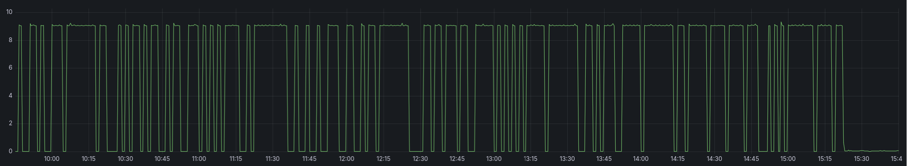

This was an issue that puzzled me for a couple of hours before figuring out what was wrong.
The below HTTP duration graph shows an obvious problem with the response times for netbox, taking up to 10 seconds.

I initially thought this had something to do with migrating the host running my Netbox service.

But after testing and validating all components used: `Nginx`, `Redis`, `Postgres` none of them showed signs of causing this latency.

Looking at the time this became an issue it occured to me, it was the same time I disabled internet connectivity for this server.
So re-enabling internet connectivity verified what caused the issue, now I needed to figure out why it was requiring internet access.

## Surprise

So as I wrote the below section I thought the issue was resolved as the response times went back to normal after setting that environment variable, but that wasn't the case.

### RELEASE_CHECK_URL

According to the docs this is disabled by default `Default: None (disabled)` [Docs: release_check_url](https://netboxlabs.com/docs/netbox/configuration/miscellaneous/#release_check_url).

But for some reason it was default enabled in the `env/netbox.env` file in the `netbox-community/netbox-docker` repo.

[RELEASE_CHECK_URL=https://api.github.com/repos/netbox-community/netbox/releases](https://github.com/netbox-community/netbox-docker/blob/5adc62fe3fa65163c4ef63733bdcbd3e59b5c544/env/netbox.env#L33)

So setting this to `RELEASE_CHECK_URL=None` in the `docker-compose.yml` fixed the issue and I can now disable internet connectivity yet again,
without slow response times from Netbox

## Solution

After spending quite some time and a [reddit thread](https://www.reddit.com/r/Netbox/comments/1vcv8cl/why_is_netbox_trying_to_connect_to_aws/) I discovered the SNI in the requests was `api.netbox.oss.netboxlabs.com`,
which is being used for showing some news feed on the dashboard.

In the quest of finding a way to disable this I found [ISOLATED_DEPLOYMENT](https://netboxlabs.com/docs/netbox/configuration/system/#isolated_deployment) which basically does what I needed.

